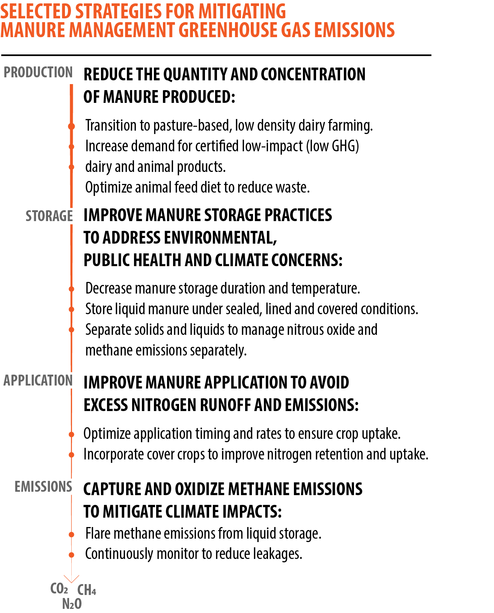

## Agricultural activities are responsible for a large proportion of New York state's nitrous oxide and methane emissions.
### Agricultural activities account for 75% of New York's nitrous oxide emissions and at least 23% of the state's methane emissions. 

Manure management and enteric fermentation from livestock account for more than half of total agricultural greenhouse gas emissions, while nitrous oxide emissions from soil management accounts for the remainder. Reducing the climate footprint of agriculture in New York will require mitigating methane emissions from livestock activities, reducing nitrogen emissions from croplands, and promoting the adoption of activities which sequester carbon. Additionally, reducing food waste and increasing composting programs will be important for reducing the overall climate impact of the food system. Landfills are responsible for 10.6% of methane emissions in New York, and a large proportion of these emissions can be tied to food waste.

> *As shown below, in 2016:* 
> * Manure management released 1.3 million metric tons of CO2 equivalents (MMT CO2eq) as methane and nitrous oxide.
> * Enteric fermentation released 3.6 MMT CO2eq as methane. 
> * Soil management released 4.0 MMT as nitrous oxide.

<iframe title="NEW YORK AGRICULTURAL EMISSIONS" aria-label="Interactive area chart" id="datawrapper-chart-ANmHa" src="https://datawrapper.dwcdn.net/ANmHa/4/" scrolling="no" frameborder="0" style="width: 0; min-width: 100% !important; border: none;" height="400"></iframe>

## Climate change poses unique threats to New York animal agriculture.
New York is the third largest dairy-producing state [(USDA ERS 2014)](https://www.ers.usda.gov/webdocs/publications/47162/17864_sb978_1_.pdf?v=2625.5), and dairy operations are particularly vulnerable to growing threats from climate change. The dairy sector experiences the largest losses from heat stress compared to other livestock industries [St Pierre et al. 2003](https://www.journalofdairyscience.org/article/S0022-0302%2803%2974040-5/abstract). Increasingly frequent periods of heat stress negatively impact the health of dairy cows, while also impacting feed production. 

Dairy cows undergo physiological changes in order to cope with heat stress, and these result in declines in milk production as well as changes in milk quality. Under heat stress, dairy cows produce milk with reduced fat and protein content, show decreased calving rates, and are more vulnerable to other health risks. The impacts of short periods of heat stress on milk production can persist for several months, making dairy cows susceptible to increases in the frequency of temperature extremes with climate change even if these are limited to particular days. [(Becker et al. 2020,](https://www.sciencedirect.com/science/article/pii/S0022030220303829) [Kadzere et al. 2002,](https://www.sciencedirect.com/science/article/abs/pii/S030162260100330X?via%3Dihub) [St-Pierre et al. 2003,](https://www.journalofdairyscience.org/article/S0022-0302%2803%2974040-5/abstract)[ West 2003)](https://www.journalofdairyscience.org/article/S0022-0302(03)73803-X/fulltext)

The effects of heat stress on milk production are already visible and will continue to be exacerbated by climate change. According to data from the [USDA ERS,](https://www.ers.usda.gov/webdocs/publications/45279/49164_err175.pdf?v=4739) heat stress was responsible for losses of approximately $39,000 in annual milk production for the average U.S. dairy in 2010. This corresponds to $1.2 billion in lost production for the entire dairy sector, including costs for heat abatement strategies. Projections of increasing heat stress on dairy production suggest that these losses will rise in coming decades. 

While New York dairies are not likely to experience heat stress as severely as southern states, projections for NY dairies still show sizable losses. According to [NYSERDA's climAID report](https://www.nyserda.ny.gov/-/media/Files/Publications/Research/Environmental/EMEP/climaid/ClimAID-Agriculture.pdf), milk production is estimated to fall by 122-245 pounds per cow per year by 2050, with projected economic losses associated with heat stress at approximately $18-$37 per cow per year. [A 2019 study](https://www.ncbi.nlm.nih.gov/pmc/articles/PMC6438606/) suggests that heat stress may result in declines of 11.6% in mean annual milk production per cow by 2050 and mean declines of 20.8% by the end of the century at the national scale.

## New York dairies are increasingly consolidated, with a few large farms carrying large herds.
12% of New York dairies account for nearly 70% of New York's dairy cow population. In 2017, only 561 farms in New York state had herd sizes over 200 cows. These operations are responsible for the bulk of methane emissions from animal agriculture. Integrating mitigating strategies to reduce emissions from these operations has the potential to reduce overall state emissions. 

<iframe title="NY State Milk Cow Inventory" aria-label="Interactive area chart" id="datawrapper-chart-WxmCn" src="https://datawrapper.dwcdn.net/WxmCn/4/" scrolling="no" frameborder="0" style="width: 0; min-width: 100% !important; border: none;" height="400"></iframe>

## Mitigating livestock greenhouse emissions will require a suite of approaches across the production lifecycle.
Greenhouse gas emissions from dairies are generated across a series of management decisions 
[(reviewed in Montes et al 2013).](https://doi.org/10.2527/jas.2013-6584). To most effectively reduce greenhouse gas emissions, interventions should be designed to prioritize reducing the magnitude of manure production and optimize manure storage conditions. Ultimately, unaverted emissions can be flared to convert methane to carbon dioxide, thereby reducing their global warming potential [(Wightman and Woodbury 2016).](https://acsess.onlinelibrary.wiley.com/doi/abs/10.2134/jeq2014.06.0269)

  

#### 1. Reduce the production of manure to avoid generating emissions
Interventions earlier in the lifecycle of manure production and management are more effective than those that only address emissions upon production. Reducing the production and concentration of manure itself — for example, through altering animal feed diets to improve production efficiency — is the only strategy to curb manure production itself and reduce the magnitude of emissions from this source. These strategies should be a top priority for adoption as they reduce the quantity of manure required to treat, in contrast to mitigating strategies that only address emissions and pollution from already-produced manure.  

#### 2. Manage manure storage to reduce emission generation
While reducing the magnitude of manure produced is the only option for avoiding emissions altogether, additional strategies can mitigate emissions from produced manure across its lifecycle from production through application. These include interventions designed to prevent conditions under which greenhouse gas emissions are intensified, such as separation of solids to reduce their contribution to methane emissions under wet conditions, aerating stored manure to prevent wet conditions, or potentially acidifying manure to reduce methane and ammonia emissions. Decreasing storage time and temperature and ensuring manure is located in sealed, covered and lined conditions can also reduce emissions and prevent air and water pollution. 

Separating manure into solid and liquid fractions allows for improved management of both nitrous oxide and methane emissions. The liquid fraction of manure contains a greater proportion of nitrogen, which is susceptible to release as nitrous oxide if applied in excess and spread under dry conditions. The solid fraction of manure contains volatile solids which stimulate methane production under wet conditions. By separating these fractions and managing separately, liquid N can be retained for future application as fertilizer, while volatile solids can be protected from wet storage to avoid methane emissions. If application of the liquid fraction of manure is synchronized with plant uptake needs to avoid excess runoff and emissions, this nitrogen can be incorporated into crops and retained in soil with limited emissions. Improving the timing and rate of application to maximize plant uptake and stabilization of applied manure can help reduce nitrous oxide emissions and prevent runoff of excess nitrogen.

#### 3. Oxidize unavoidable emissions to reduce their global warming potential
Flaring methane emissions from the covered liquid fraction provides a strategy to mitigate emissions of methane, while also avoiding nitrous emissions which would occur under dry conditions. Flaring oxidizes methane to carbon dioxide, which reduces the global warming potential of these emissions. In contrast to the high costs of biodigesters, capture and flare of methane from dairy operations was estimated to cost 0.005 per liter of milk in NY state, or $380,000 for a dairy with 1000 milking cows. This translates to approximately $8.63 per Mg CO2eq, compared to estimates of $140-170/Mg CO2eq for biodigester operations [(Wightman and Woodbury 2016).](https://acsess.onlinelibrary.wiley.com/doi/abs/10.2134/jeq2014.06.0269) 

Reducing the disprortionately large contribution of livestock to New York state greenhouse gas emissions will require adopting a suite of mitigating strategies, including the ones described above and others, to address the full the lifecycle of greenhouse gas production.

*Working draft prepared by the Sustainable Food and Farming Program at Earthjustice.
